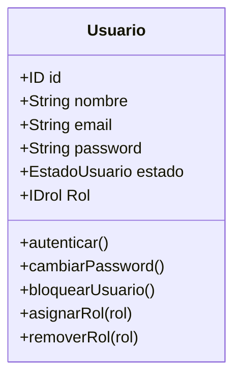
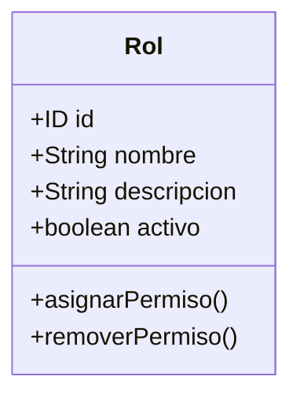
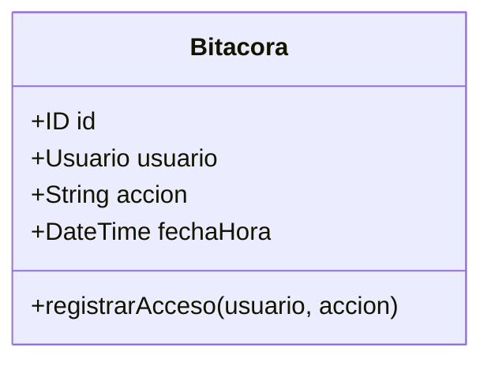
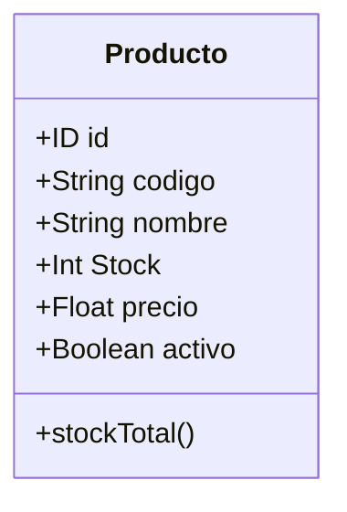
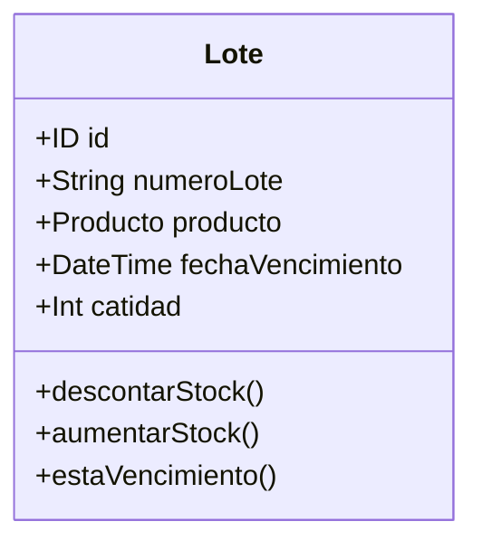
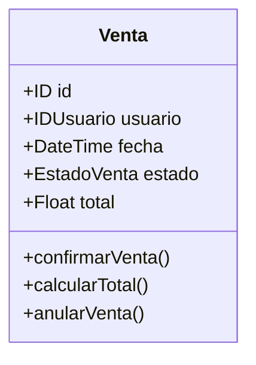
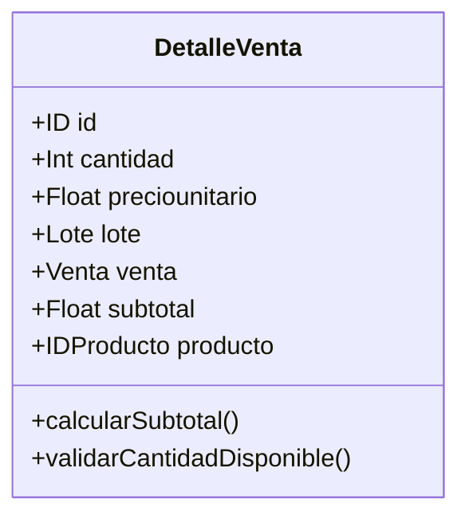
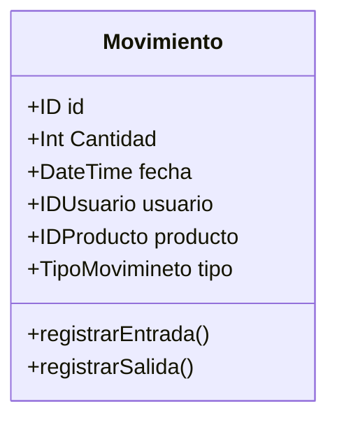
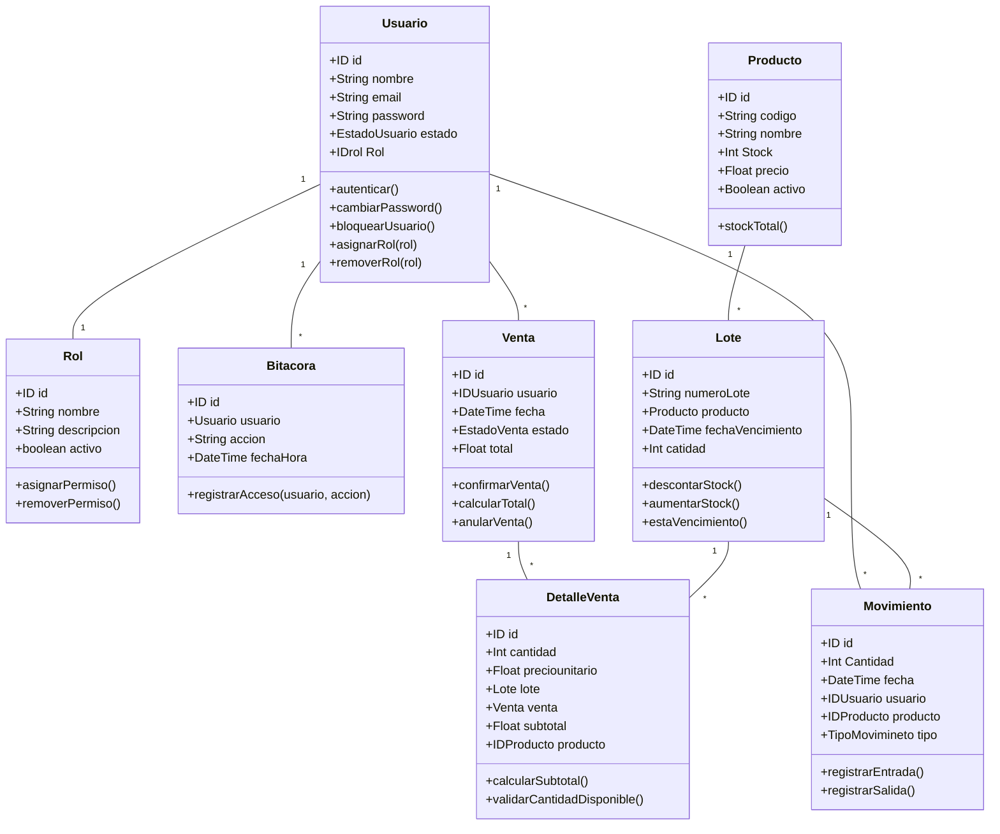

# Diagrama de Clases

## MicroServicio **Login**

### Clases 

- **Clase Usuario**

- **Clase Rol**

- **Clase Bitacora**

## MicroServicio **Inventario**

### Clases 

- **Clase Producto**

- **Clase Lote**

- **Clase Venta**

- **Clase DetalleVenta**

- **Clase Movimiento**

- **Diagrama de Clases**

