# FarmaExpres-backend

## Diagrama de clases 

- Siguiendo los lineamientos de los Requerimientos se realiza el Diagrama de Clases para el SOftware de FarmaExpres.
[Requerimientos](https://github.com/JerssonF/Week-3.git)

### Creacion de las Clases

#### *Creacion de Clases de autenticación*

- **Clase Usuario**
- Gestiona autenticación y control de acceso.
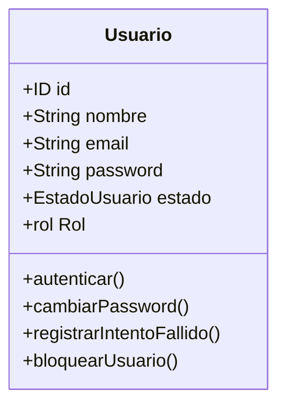

- **Clase Rol** 
- Define permisos del usuario.

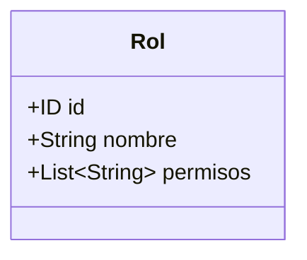

- **Clase Sesion** 
- Controla acceso e inactividad.

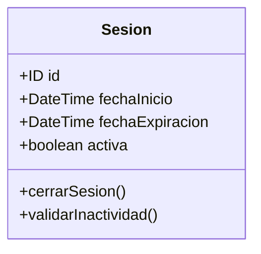

- **Clase Bitacora** 
- Registra acciones críticas del sistema.

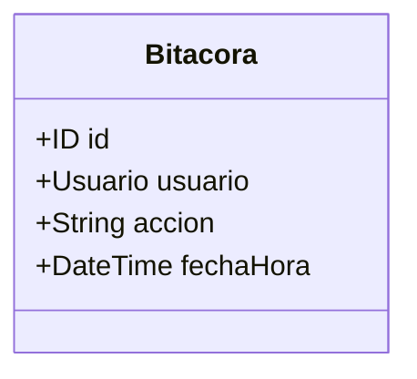

#### *Creacion de Clases de Inventario*

- **Clase de Medicamento**
- Entidad principal del catálogo.

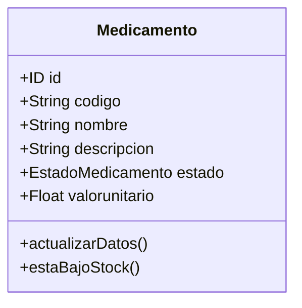

- **Clase Lote**
- Permite trazabilidad por número y vencimiento.

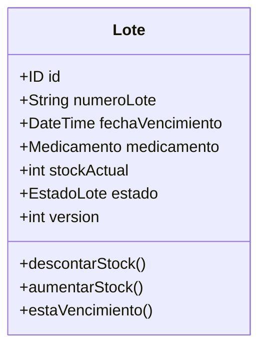

#### *Creacion de Clases de Movimientos*

- **Clase Movimiento**

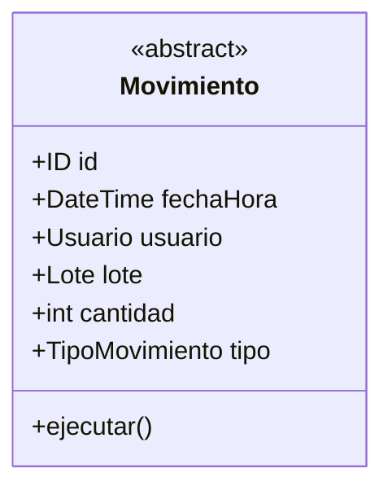

- **Clase HistorialMovimiento**
- Permite Guardar toda la información de los movimientos.
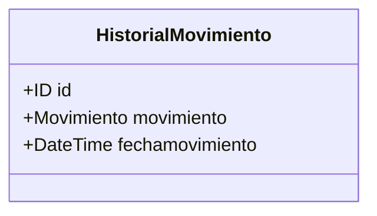

#### *Creacion de pagos*
- **Case venta**
- Representa la operación comercial.

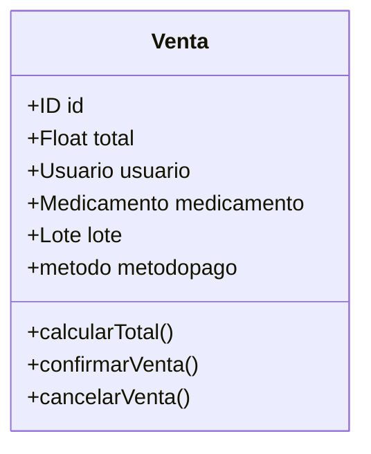

#### *Servicios de Aplicación*

- **InventarioService**

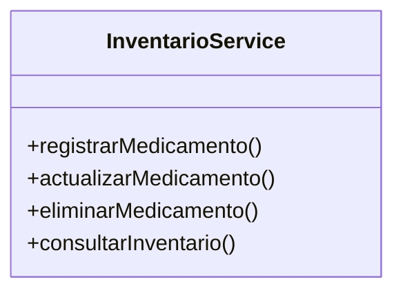

- **AlertService** 

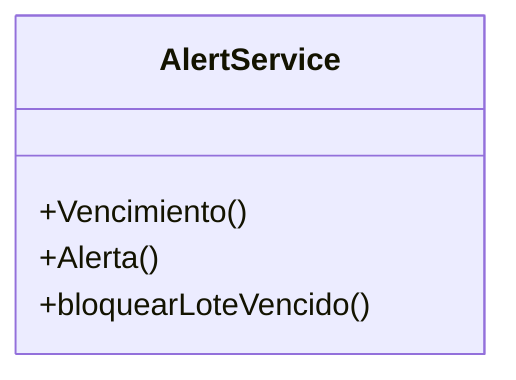
### Diagrama de Clases 

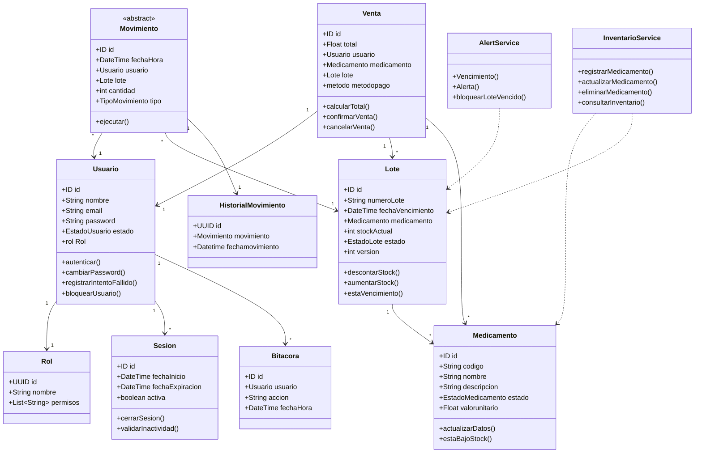

